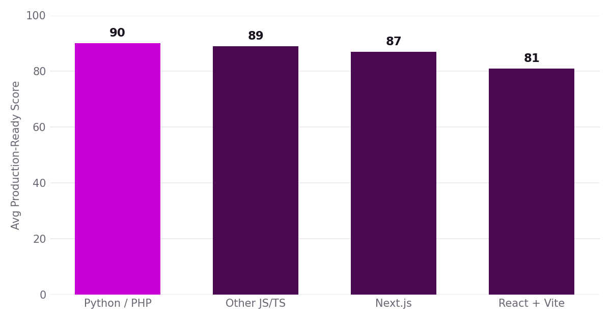
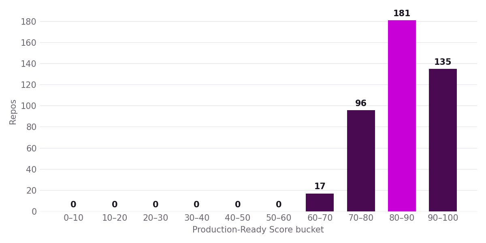

# The State of AI-Generated Code, 2026

Published July 2026 by [Quality Clouds Hub](https://qualityclouds.com) · Data available under CC-BY-4.0

> **14% of AI-generated projects ship with a leaked secret or hardcoded credential.
> 52% of Supabase-backed apps have at least one client-side security
> misconfiguration. The average Production-Ready Score is 85 out of 100.**

## Key findings

- We scanned **429 public projects** built with Lovable, Bolt, v0, and AI-copilot-tagged
  GitHub repos — **23,095,920 lines of code** in total.
- The scans produced **362,115 issues** (15.7 per 1,000 lines of code).
- The average **Production-Ready Score is 85 / 100** (median 86).
- **14%** of projects shipped at least one leaked secret or hardcoded credential.
- **52%** of the 206 Supabase-backed projects had at least
  one client-side security misconfiguration (exposed service-role keys, client-side auth logic,
  public buckets…).
- **Next.js** projects scored highest on average; **React + Vite** lowest.
- **20%** of projects are
  **NOT production-ready** under the Hub's certification bar — not for a low overall score, but
  because at least one impact area collapses below the hard-fail threshold.
  31% reach GOLD.

## Issues by impact area

| Impact area | Issues | Repos affected |
|---|---|---|
| Scalability | 160,248 | 390 |
| Maintainability | 67,483 | 387 |
| Performance | 59,006 | 384 |
| Manageability | 53,390 | 394 |
| Security | 21,826 | 372 |
| Architecture | 162 | 29 |

## Top 10 most frequent findings

| Rule | Area | Severity | Issues | % repos |
|---|---|---|---|---|
| Array.forEach() With Async Callback | scalability | MEDIUM | 17,998 | 80% |
| Async Operation Without Error Handling | scalability | HIGH | 138,601 | 79% |
| Nested ternary expression | maintainability | MEDIUM | 34,535 | 78% |
| Synchronous setState Inside useEffect | performance | HIGH | 40,220 | 74% |
| console.log Used Instead of Structured Logging | manageability | MEDIUM | 31,441 | 74% |
| Implicit Boolean Coercion via Double Negation | maintainability | LOW | 23,881 | 73% |
| Network Request Without Timeout | performance | MEDIUM | 12,576 | 71% |
| Empty Catch Block Swallows Errors | manageability | HIGH | 9,761 | 67% |
| Dynamic Value Bound to href Without URL Validation | security | HIGH | 3,511 | 63% |
| Wildcard Dependency Version | security | HIGH | 6,038 | 52% |

## Score by frontend framework

| Framework | Repos | Avg score | Issues / KLOC |
|---|---|---|---|
| Python / PHP | 38 | **90** | 10.0 |
| Other JS/TS | 44 | **89** | 10.5 |
| Next.js | 127 | **87** | 13.9 |
| React + Vite | 215 | **81** | 17.1 |

## By generation platform

| Origin | Repos | Avg score | Median issues | Issues / KLOC |
|---|---|---|---|---|
| Bolt | 43 | 89 | 134 | 11.4 |
| AI-tagged GitHub | 92 | 88 | 96 | 9.5 |
| v0 | 111 | 88 | 95 | 16.5 |
| Lovable | 183 | 80 | 644 | 18.1 |

## Charts

## Methodology

Projects were sampled from public GitHub repositories carrying unambiguous markers of the
generation platform (Lovable/v0/Bolt README templates, AI topics), filtered by size and recency,
capped at 2 repos per owner. Each was scanned with the **same deterministic rule engine and the
same 295 production rules** (Semgrep + regex) that power the Quality Clouds Hub scanner,
and scored with the Hub's
production-readiness formula. **Individual repositories are never named — only aggregate
statistics are published.** Full details in [docs/methodology.md](docs/methodology.md) and
[docs/ruleset.md](docs/ruleset.md).

## Downloads

| File | Contents |
|---|---|
| [data/vibe-code-2026.csv](data/vibe-code-2026.csv) | Per-repo metrics (anonymized), one row per project |
| [data/vibe-code-2026.json](data/vibe-code-2026.json) | Same as above, JSON |
| [data/aggregate-stats.csv](data/aggregate-stats.csv) | Headline aggregate statistics |

## Reproduce

Scan your own repository with the same ruleset at [qualityclouds.com](https://qualityclouds.com) —
import your repo and get a Production-Ready Score in minutes.

## License

**Data:** CC-BY-4.0 — reuse with attribution · **Pipeline code:** MIT
