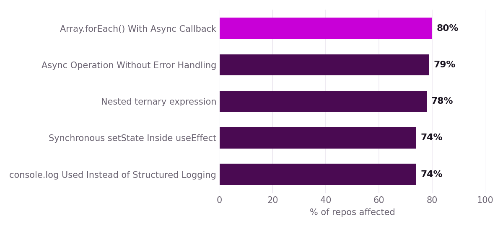

# The State of AI-Generated Code, 2026


Published July 2026 by [Quality Clouds Hub](https://qualityclouds.ai) · Data available under CC-BY-4.0

> **14% of AI-generated projects ship with a leaked secret or hardcoded credential.
> 98% of Supabase-backed apps carry at least one security finding, against 77% of
> everything else. Across 21.6 million lines of AI-generated code, we found one issue
> every 62 lines.**


## Key findings

- We scanned **424 public projects** built with Lovable, Bolt, v0, and AI-copilot-tagged
  GitHub repos, totalling **21,632,176 lines of code**.
- The scans produced **346,944 issues**, or **16.0 per 1,000 lines of code**.
- **87%** of projects have at least one security finding. Only **56 of 424** are clean on
  security.
- Security findings are **6%** of all findings (21,361 of 346,944). We lead on security
  because it is the consequential category, not the common one.
- **14%** of projects shipped at least one leaked secret or hardcoded credential.
- **98%** of the 206 Supabase-backed projects have at least one security finding, against
  **77%** of non-Supabase projects, at 2.4x the security-issue density. Supabase-backed
  apps carry a distinct class of client-side exposure (service-role keys, client-side auth
  logic, public buckets) that the other stacks avoid by never reaching for a BaaS. The
  baseline matters: Supabase amplifies the problem, it does not create it.
- The single most common HIGH finding, *Async Operation Without Error Handling*, appears in
  **79%** of projects. One caveat worth knowing before that number gets quoted: it fires
  138,601 times, which is roughly 68% of every HIGH finding in the corpus, and 10 of our 295
  rules produce 88% of all findings. Our severity mix is mostly a statement about a handful
  of rules.

## AI code generators, ranked by quality

Ranked by **issue density** (issues per 1,000 lines of code, lower is better).

| # | Generator | Repos | Issues / KLOC | Security issues / KLOC | Projects with a security finding | Median issues per project |
|---|---|---|---|---|---|---|
| 1 | **AI-tagged GitHub** (Copilot-assisted) | 89 | **9.1** | **0.33** | 65% | 82 |
| 2 | **Bolt** | 42 | **11.4** | **0.54** | 67% | 143 |
| 3 | **v0** | 110 | 16.6 | 1.11 | 92% | 94 |
| 4 | **Lovable** | 183 | **18.1** | **1.18** | **99%** | **644** |

**How stable is this ordering?** The split into a clean tier (Copilot, Bolt) and a dirty tier
(v0, Lovable) holds across every cut we tried, and it is the part we would defend. The 3rd
versus 4th placing does not hold. Exclude the Scalability bucket, where our highest-volume
rule lives, and Lovable and v0 swap (10.4 against 10.8). Lovable is worse on total density,
security density, security exposure and by a long way on median issues per project, so on
balance it does place last, but treat "Lovable is worse than v0" as weakly supported.
"v0 and Lovable are worse than Bolt and Copilot" is the finding.

**What separates them.** Bolt and Copilot-assisted repos produce roughly **half** the issue
density of v0 and Lovable, and **a third to a half** of their security-issue density. The gap
is starkest on security exposure: about two thirds of Bolt and Copilot projects carry at least
one security finding, against **92% for v0 and 99% for Lovable**. Of 183 Lovable projects,
exactly two are clean on security.

Lovable's median project also ships **644 issues**, roughly 4.5x the median of any other
platform. Some of that is Supabase: **84%** of Lovable projects are Supabase-backed, against
3% of Copilot-assisted repos.

Issue density by impact area (issues per KLOC, lower is better):

| Generator | Security | Performance | Scalability | Manageability | Maintainability |
|---|---|---|---|---|---|
| AI-tagged GitHub | **0.3** | **0.7** | **5.0** | **1.3** | **1.7** |
| Bolt | 0.5 | 1.2 | 5.4 | 2.6 | **1.7** |
| v0 | 1.1 | 3.6 | 5.8 | **4.0** | 2.2 |
| Lovable | **1.2** | 3.2 | **7.8** | 2.4 | **3.6** |

**Caveat on the leader.** "AI-tagged GitHub" repos are Copilot-*assisted*, not fully
AI-*generated*. A human drove the architecture and reviewed the output. It is a control group
rather than a like-for-like competitor, and the fact that it wins is itself the finding: the
more of the codebase the model authors unsupervised, the worse the density gets.

**Caveat on the whole table.** These are public repos carrying platform markers. A repo that
still has the Lovable README template in it is, almost by definition, one nobody cleaned up,
and Lovable's users may be newer to software than the average Copilot user. We cannot separate
the tool from the person driving it. This ranks what ships from each platform in our sample.
It is not a benchmark of model quality.

## By frontend framework

| Framework | Repos | Issues / KLOC |
|---|---|---|
| Other / non-web (mixed languages) | 34 | **9.5** |
| Node, no framework | 44 | 10.5 |
| Next.js | 126 | 13.9 |
| React + Vite | 215 | **17.1** |
| Remix | 2 | 18.3 |
| Vue | 2 | 19.2 |
| React (CRA) | 1 | 26.0 |

React + Vite, the default output of most prompt-to-app tools, is the dirtiest stack in the
corpus at 80% higher issue density than the non-web bucket. The bottom three rows have sample
sizes of 1 to 2 repos and are shown only so the table accounts for all 424 projects. Draw
nothing from them.

Framework and language are separate cuts, and conflating them is misleading. By language:
Python **4.0** issues per KLOC across 43 repos, JavaScript **15.3** across 37, TypeScript
**16.9** across 344. Python's advantage is mostly composition rather than language: Python
repos here are disproportionately scripts and backends, not the React SPAs where the
high-frequency rules fire. There is no PHP in this corpus.

## Issues by impact area

| Impact area | Issues | Repos affected |
|---|---|---|
| Scalability | 150,212 | 386 |
| Maintainability | 65,152 | 382 |
| Performance | 57,821 | 380 |
| Manageability | 52,236 | 389 |
| Security | 21,361 | 368 |
| Architecture | 162 | 29 |

Scalability leads this table, and 97% of that bucket is two rules. Read the ordering with that
in mind.

## Top 10 most frequent findings

> Counts in this table are from the full scan before deduplication (see Methodology) and will
> move by roughly -4% when regenerated. Ordering is unaffected.

| Rule | Area | Severity | Issues | % repos |
|---|---|---|---|---|
| Async Operation Without Error Handling | scalability | HIGH | 138,601 | 79% |
| Synchronous setState Inside useEffect | performance | HIGH | 40,220 | 74% |
| Nested ternary expression | maintainability | MEDIUM | 34,535 | 78% |
| console.log Used Instead of Structured Logging | manageability | MEDIUM | 31,441 | 74% |
| Implicit Boolean Coercion via Double Negation | maintainability | LOW | 23,881 | 73% |
| Array.forEach() With Async Callback | scalability | MEDIUM | 17,998 | 80% |
| Network Request Without Timeout | performance | MEDIUM | 12,576 | 71% |
| Empty Catch Block Swallows Errors | manageability | HIGH | 9,761 | 67% |
| Wildcard Dependency Version | security | HIGH | 6,038 | 52% |
| Dynamic Value Bound to href Without URL Validation | security | HIGH | 3,511 | 63% |

These ten rules are **88% of all findings**, and the five HIGH rules here are **97% of all
HIGH findings**. Per-rule counts per repo are the cut you would need to re-weight this
yourself. That column is not in the published CSV yet and it should be. It is the next thing
we are adding.

## Charts



## Methodology

Projects were sampled from public GitHub repositories carrying unambiguous markers of the
generation platform (Lovable/v0/Bolt README templates, AI topics), filtered by size and
recency, capped at 2 repos per owner. Each was scanned with the **same deterministic rule
engine and the same 295 production rules** (Semgrep + regex) that power the Quality Clouds
Hub scanner. **Individual repositories are never named, only aggregate statistics are
published.** Full details in [docs/methodology.md](docs/methodology.md) and
[docs/ruleset.md](docs/ruleset.md).

All comparisons in this report are made on **issue density** (issues per 1,000 lines of code)
rather than raw counts, so that larger projects are not penalised for their size.

**Corrections, 14 July 2026.** An audit of the published CSV before wider release found and
fixed the following. The dataset contained 8 rows forming 3 groups identical on every field.
One repo appeared four times, carrying 477,438 lines, 6.3% of the reported corpus on its own,
which also breached our own 2-per-owner cap. Deduplicating moves the corpus from 429 to 424
repos, 23.1M to 21.6M lines and 362,115 to 346,944 issues, and the headline from 15.7 to 16.0
issues per KLOC. The ranking is unchanged; the duplicated repo was in the Copilot control
group, so removing it improves the leader from 9.5 to 9.1. The framework table previously
labelled its buckets with language names: the row called "Python / PHP" was the
`framework == other` bucket (27 Python, 7 JavaScript, 4 TypeScript) and there is no PHP in the
corpus at all. That table also silently dropped 5 repos, including a 444k-line Lovable
project. A previous claim that "52% of Supabase-backed apps have at least one client-side
security misconfiguration" could not be reproduced from the published data, which puts the
figure at 98%, and has been withdrawn pending a rerun. A previous claim that the ordering was
"stable across every independent metric we measured" was wrong, and a claim that exactly one
Lovable project was clean on security was wrong; the number is two. The severity split, the
per-rule counts above and the 14% leaked-secret figure are pipeline outputs with no per-repo
column, so they cannot yet be independently reproduced from this dataset.

## Downloads

| File | Contents |
|---|---|
| [data/vibe-code-2026.csv](data/vibe-code-2026.csv) | Per-repo metrics (anonymised), one row per project |
| [data/vibe-code-2026.json](data/vibe-code-2026.json) | Same as above, JSON |
| [data/aggregate-stats.csv](data/aggregate-stats.csv) | Headline aggregate statistics |

## Reproduce

The generator ranking, in five lines. Note `g['loc']` rather than `g.loc`: the column is named
`loc` and pandas reserves that attribute for the row indexer.

```python
import pandas as pd
d = pd.read_csv('data/vibe-code-2026.csv')
d.groupby('origin').apply(
    lambda g: round(1000 * g.total_issues.sum() / g['loc'].sum(), 1),
    include_groups=False,
).sort_values()
# generic-ai 9.1 | bolt 11.4 | v0 16.6 | lovable 18.1
```

Scan your own repository with the same ruleset at
[portal.qualityclouds.ai](https://portal.qualityclouds.ai/?utm_source=github&utm_medium=readme&utm_campaign=state-of-ai-code-2026&utm_content=report-cta), import your repo and see every
finding in minutes.

## License

**Data:** CC-BY-4.0, reuse with attribution · **Pipeline code:** MIT
